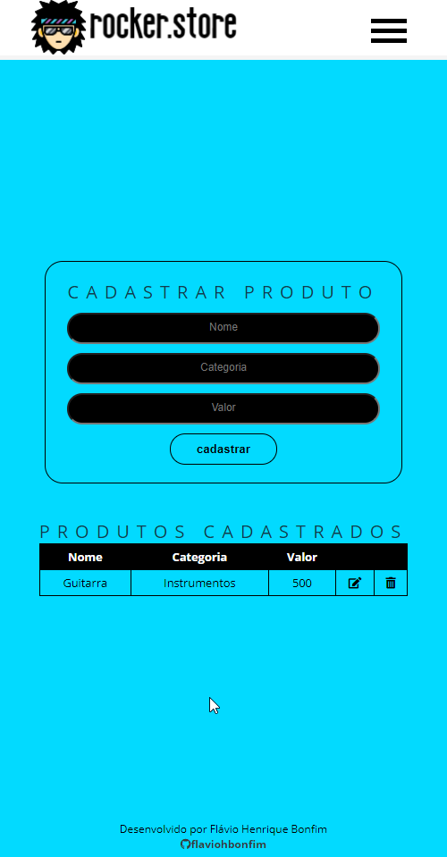

<b>Desafio #02: Gestão de Cadastros</b>

O projeto foi desenvolvido utilizando HTML, CSS e JavaScript. 
Foi feito um controle de login, neste primeiro momento fixo (usuario e senha = admin), então caso o usuário não esteja logado as demais telas do sistemas não abrem. 
Foram utilizadas duas classes para estruturar os dados de clientes e produtos. 
Cada estrutura tem sua pagina para controle, com um formulário para entrada dos dados e uma lista para gerenciar os dados cadastrados. 
Coloquei uma validação básico nos cadastros, quando houver algum campo nao preenchido ele da um alerta e não deixa seguir. 
Na lista foram incluidas opções para editar ou excluir o registro selecionado. 
Todos os dados estão sendo armazenados no localStorage. 
Projeto construído para ser responsivo. 
A primeira tela do sistema mostra a quantidade de cadastros existentes e para controlar isso foram criadas duas funções para totalizar os dados de cada classe armazenada no localStorage (totalClientes, totalProdutos). 
Existe também uma função para limpar os dados armazenados quando o usuário faz o logout do sistema (limparDados).  

<b>Screenshots desktop</b> 

<b>Screenshots mobile</b> 

<b>Projeto desenvolvido durante o Hiring Coders 2021.</b>
<b>Gama Academy / VTEX</b>